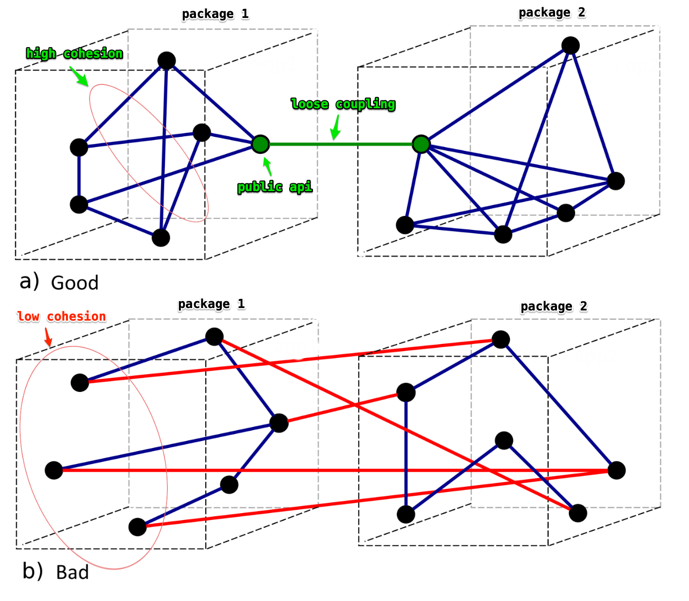
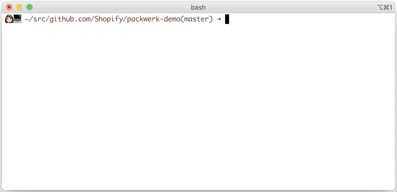

# Packwerk usage

## Table of Contents
* [What problem does Packwerk solve?](#What-problem-does-Packwerk-solve?)
* [What is a package?](#What-is-a-package?)
  * [Package principles](#Package-principles)
* [Getting started](#Getting-started)
* [Setting up configuration file](#Setting-up-configuration-file)
  * [Inflections](#Inflections)
* [Validating the package system](#Validating-the-package-system)
* [Defining packages](#Defining-packages)
  * [Package metadata](#Package-metadata)
* [Types of boundary checks](#Types-of-boundary-checks)
  * [Enforcing privacy](#Enforcing-privacy)
    * [Using public folders](#Using-public-folders)
  * [Enforcing dependency](#Enforcing-dependency)
* [Checking for violations](#Checking-for-violations)
* [Recording existing violations](#Recording-existing-violations)
  * [Understanding the list of deprecated references](#Understanding-the-list-of-deprecated-references)

## What problem does Packwerk solve?
Large applications need clear boundaries to avoid turning into a [ball of mud](https://en.wikipedia.org/wiki/Big_ball_of_mud). However, Ruby does not provide a good solution to enforcing boundaries between code.

Packwerk is a gem that can be used to enforce boundaries between groups of code we call packages.

## What is a package?
A package is a folder containing autoloaded code. To decide whether code belongs together in a package, these are some design best practices:

- We should package things together that have high functional [cohesion](https://en.wikipedia.org/wiki/Cohesion_(computer_science)).
- Packages should be relatively loosely coupled to each other.



### Package principles

Package principles help to guide the organization of classes in a large system. These principles can also be applied to packages in large and complex codebases.

The [package principles](https://en.wikipedia.org/wiki/Package_principles) page on Wikipedia does a good job explaining what well designed packages look like.

## Getting started

After including Packwerk in the Gemfile, you can generate the necessary files to get Packwerk running by executing:

    bundle exec packwerk init

Here is a list of files generated:

| File                        | Location     | Description |
|-----------------------------|--------------|------------|
| Packwerk configuration      | packwerk.yml | See [Setting up configuration file](#Setting-up-configuration-file) |
| Root package                | package.yml  | A package for the root folder |
| Bin script                  | bin/packwerk | For Rails applications to run Packwerk validation on CI, see [Validating the package system](#Validating-the-package-system) |
| Validation test             | test/packwerk_validator_test.rb | For Ruby projects to run Packwerk validation using tests, see [Validating the package system](#Validating-the-package-system) |
| Custom inflections          | configs/inflections.yml | A custom inflections file is only required if you have custom inflections in `inflections.rb`, see [Inflections](#Inflections) |

After that, you may begin creating packages for your application. See [Defining packages](#Defining-packages)

## Setting up the configuration file

Packwerk reads from the `packwerk.yml` configuration file in the root directory. Packwerk will run with the default configuration if any of these settings are not specified.

| Key                  | Default value                      | Description  |
|----------------------|------------------------------------|--------------|
| include              | **/*.{rb,rake,erb}                 | list of patterns for folder paths to include |
| exclude              | {bin,node_modules,script,tmp}/**/* | list of patterns for folder paths to exclude |
| package_paths        | **/                                | patterns to find package configuration files, see: Defining packages |
| load_paths           | All application autoload paths     | list of load paths |
| custom_associations  | N/A                                | list of custom associations, if any |


### Inflections

Packwerk requires custom inflections to be defined in `inflections.yml` instead of the traditional `inflections.rb`. This is because Packwerk accounts for custom inflections, such as acronyms, when resolving constants. Additionally, Packwerk interprets Active Record associations as references to constants. For example, `has_many :birds` is reference to the `Birds` constant.

In order to make your custom inflections compatible with Active Support and Packwerk, you must create an `inflections.yml` file and point `ActiveSupport::Inflector` to that file.

In `inflections.rb`, add:

```rb
ActiveSupport::Inflector.inflections do |inflect|
  # please add all custom inflections in the file below.
  Packwerk::Inflections::Custom.new(
    Rails.root.join("inflections.yml")
  ).apply_to(inflect)
end
```

Next, move your existing custom inflections into `inflections.yml`:

```yaml
acronym:
  - 'GraphQL'
  - 'MRuby'
  - 'TOS'
irregular:
  - ['analysis', 'analyses']
  - ['reserve', 'reserves']
uncountable:
  - 'payment_details'
```

Any new inflectors should be added to `inflections.yml`.

## Validating the package system

There are some criteria that an application must meet in order to have a valid package system. These criteria include having a valid autoload path cache, package definition files, and application folder structure. The dependency graph within the package system also has to be acyclic.

The package system can be validated through a series of built in validation checks. Currently, the validation checks require the application to be booted either through `spring` or as part of its test suite.

We recommend setting up the package system validation for your Rails application in a CI step (or through a test suite for Ruby projects) separate from `packwerk check`.

If running `packwerk init` generates a `bin/packwerk` script, proceed to run:

    bin/packwerk validate



If running `packwerk init` on your Ruby project generates `test/packwerk_validator_test.rb`, you can use this test as validation.

## Defining packages

You can create a `package.yml` in any folder to make it a package. The package name is the path to the folder from the project root.

_Note: It is helpful to define a namespace that corresponds to the package name and contains at least all the public constants of the package. This makes it more obvious which package a constant is defined in._

### Package metadata
Package metadata can be included in the `package.yml`. Metadata won't be validated, and can thus be anything. We recommend including information on ownership and stewardship of the package.

Example:
```yaml
    # components/sales/package.yml
    metadata:
      stewards:
      - "@Shopify/sales"
      slack_channels:
      - "#sales"
```

## Types of boundary checks

Packwerk can perform two types of boundary checks: privacy and dependency.

#### Enforcing privacy boundary
A package's privacy boundary is violated when there is a reference to the package's private constants from a source outside the package.

There are two ways you can enforce privacy for your package:

1. Enforce privacy for all external sources

```yaml
# components/merchandising/package.yml
enforce_privacy: true  # will make everything private that is not in
                        # the components/merchandising/app/public folder
```

Setting `enforce_privacy` to true will make all references to private constants in your package a violation.

2. Enforce privacy for specific constants

```yaml
# components/merchandising/package.yml
enforce_privacy:
  - "::Merchandising::Product"
  - "::SomeNamespace"  # enforces privacy for the namespace and
                       # everything nested in it
```

It will be a privacy violation when a file outside of the `components/merchandising` package tries to reference `Merchandising::Product`.

##### Using public folders
You may enforce privacy either way mentioned above and still expose a public API for your package by placing constants in the `app/public` folder. The constants in the public folder will be made available for use by the rest of the application.

#### Enforcing dependency boundary
A package's dependency boundary is violated whenever it references a constant in some package that has not been declared as a dependency.

Specify `enforce_dependencies: true` to start enforcing the dependencies of a package. The intentional dependencies of the package are specified as a list under a `dependencies:` key.

Example:

```yaml
# components/shop_identity/package.yml
enforce_dependencies: true
dependencies:
  - components/platform
```

It will be a dependency violation when `components/shop_identity` tries to reference a constant that is not within `components/platform` or itself.

## Checking for violations

After enforcing the boundary checks for a package, you may execute:

    bundle exec packwerk check

Packwerk will check the entire codebase for any violations.

You can also specify folders or packages for a shorter run time:

    bundle exec packwerk check components/your_package


In order to keep the package system valid at each version of the application, we recommend running `packwerk check` in your CI pipeline.

See: [TROUBLESHOOT.md - Sample violations](TROUBLESHOOT.md#Sample-violations)

## Recording existing violations

For existing codebases, packages are likely to have existing boundary violations.

If so, you will want to stop the bleeding and prevent more violations from occuring. The existing violations in the codebase can be recorded in a [deprecated references list](#Understanding_the_list_of_deprecated_references) by executing:

    bundle exec packwerk update

Similar to `packwerk check`, you may also run `packwerk update` on folders or packages:

    bundle exec packwerk update components/your_package


_Note: Changing dependencies or enabling dependencies will not require a full update of the codebase, only the package that changed. On the other hand, changing or enabling privacy will require a full update of the codebase._

`packwerk update` should only be run to record existing violations and to remove deprecated references that have been worked off. Running `packwerk update` to resolve a violation should be the very last resort.

See: [TROUBLESHOOT.md - Troubleshooting violations](TROUBLESHOOT.md#Troubleshooting_violations)


### Understanding the list of deprecated references

The deprecated references list is called `deprecated_references.yml` and can be found in the package folder. The list outlines the constant violations of the package, where the violation is located, and the file defining the violation.

The deprecated references list should not be added to, but worked off over time.

```yaml
components/merchant:
  "::Checkouts::Core::CheckoutId":
    violations:
    - dependency
    files:
    - components/merchant/app/public/merchant/generate_order.rb
```

Above is an example of a constant violation entry in `deprecated_references.yml`.

* `components/merchant` - package where the constant violation is found
* `::Checkouts::Core::CheckoutId` - violated constant in question
* `dependency` - type of violation, either dependency or privacy
* `components/merchant/app/public/merchant/generate_order.rb` - path to the file containing the violated constant

Violations exist within the package that makes a violating reference. This means privacy violations of your package can be found listed in `deprecated_references.yml` files in the packages with the reference to a private constant.
